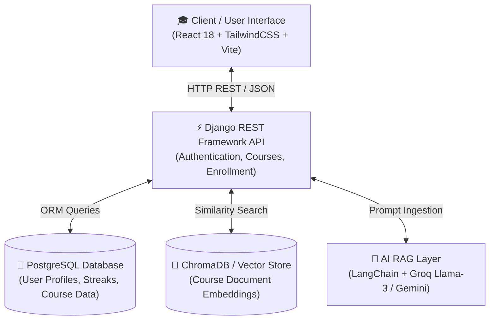

<div align="center">

# 🎓 BrightRoot Academy Platform
### Next-Generation AI-Powered Learning Management System (LMS)

[]()
[]()
[]()
[]()
[]()

**Empowering Students and Instructors with Personalized RAG-driven Education Intelligence.**

</div>

---

## 🌟 Executive Summary

**BrightRoot Academy** is a modern, state-of-the-art **Learning Management System (LMS)** engineered by **INSA Group 6**. It bridges traditional educational management with cutting-edge **Artificial Intelligence (AI)**.

By leveraging **Retrieval-Augmented Generation (RAG)** powered by **LangChain**, **Groq Llama 3**, and **Google Gemini**, BrightRoot Academy transforms static course materials into interactive, adaptive learning experiences. Students receive instant, context-aware answers to course queries, automated quiz generation, and personalized study recommendations, while instructors gain deep telemetry into student progress and engagement.

---

## 🏗 System Architecture



### 🧠 RAG & AI Pipeline Flow

1. **Document Ingestion**: Course PDFs, lecture notes, and syllabus materials are chunked and vectorized using LangChain embeddings.
2. **Semantic Search**: Student questions trigger similarity searches across ChromaDB vector store.
3. **Contextual Generation**: Relevant document chunks are injected into Groq Llama 3 / Gemini prompt templates to deliver hallucination-free, accurate answers.

---

## 🚀 Features

* **Frontend (React + Tailwind)**:
  * Responsive, dark mode UI
  * Student & instructor dashboards
  * Course browsing 

* **Backend (Django REST API)**:
  * Authentication & user roles (students/instructors/admins)
  * Course, enrollment & progress management
  * Secure API endpoints

* **AI Layer (LangChain + Groq)**:
  * RAG-powered chatbot for course Q&A
  * Personalized learning recommendations
  * Vector database integration for knowledge retrieval

---

## 🛠 Tech Stack

* **Frontend**: React, TailwindCSS, Vite
* **Backend**: Django REST Framework, PostgreSQL
* **AI/LLM**: LangChain, Groq, ChromaDB (vector DB)
* **Infra/DevOps**: Docker, GitHub Actions (CI/CD), Render/Heroku

---

## ⚙️ Installation

1. **Clone repo**

```bash
git clone https://github.com/Miftah-Ebrahim/INSA_Group6_BrightRoot_Academy.git
cd INSA_Group6_BrightRoot_Academy
```

2. **Setup Backend**

```bash
cd Backend
pip install -r requirements.txt
python manage.py migrate
python manage.py runserver
```

3. **Setup Frontend**

```bash
cd front-end
npm install
npm run dev
```

---

## 📜 License

MIT License © 2025 BrightRoot Academy — INSA Group 6
